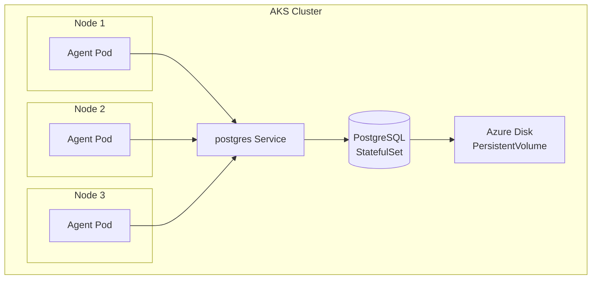
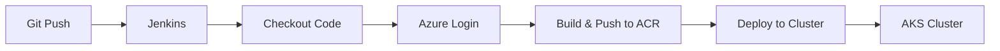

# Linux Cluster Monitoring Agent — Kubernetes CI/CD

## Introduction

The goal of this project is to provide centralized, automated monitoring of a
Linux server cluster. By continuously tracking the health and resource usage of
every machine, the team has a single, up-to-date view of the entire health of each node within the cluster.
The system collects metrics from every node automatically and stores them in one place 
that will be used for analysis, while the deployment itself is automated so new 
versions roll out with a single pipeline run.

## Application architecture:

The monitoring agent runs as a Kubernetes DaemonSet (one agent pod per node), each collecting metrics from the node it
runs on and writing to a centralized PostgreSQL database 
deployed as a StatefulSet with a persistent volume. 
A Kubernetes Service gives the database a stable
network address. This system allows for agents to 
collect on a timer and write out, so it does not use a load balancer
or request-based auto-scaling.

**Dev and prod environments:** Two separate AKS clusters (`lca-cluster-dev` and
`lca-cluster-prod`), each with its own PostgreSQL database, both pulling the
same container image from a shared Azure Container Registry (ACR). 

**Note:** Environments are isolated so development work cannot affect production.

### Kubernetes Deployment

Inside each cluster, the DaemonSet runs one agent pod per node, all writing to a
single PostgreSQL StatefulSet. The StatefulSet is backed by a PersistentVolume
(an Azure managed disk), and a Service provides the stable address the agents
connect to.

## Jenkins CI/CD Pipeline

Jenkins runs a Declarative Pipeline that authenticates to Azure using a service
principal, then deploys the application to the cluster by updating the
DaemonSet's image (`kubectl set image`). Dev deploys the `develop` branch; prod
deploys the `master` branch.

Pipeline stages:
1. **Checkout** — Jenkins clones repository.
2. **Azure Login** — authenticates using the stored service principal.
3. **Build & Push** — builds the image and pushes to ACR
4. **Deploy** — updates the target cluster's DaemonSet with `kubectl set image`.

The pipeline runs on a Kubernetes agent pod using a custom image
(`jrvs/jenkins_agent:az_kubectl`) pre-loaded with Azure CLI and kubectl.

## Improvements

1. **Managed database** — PostgreSQL currently runs self-managed in-cluster as a
   StatefulSet. Migrating to Azure Database for PostgreSQL would offload backups,
   patching, and high availability to Azure.

2. **Secrets in a vault** — database credentials are stored as Kubernetes Secrets
   (base64-encoded, not encrypted). Moving them to Azure Key Vault would provide
   proper encryption and access control.
   
