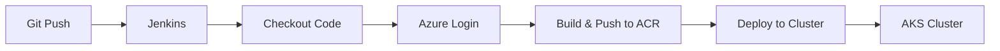
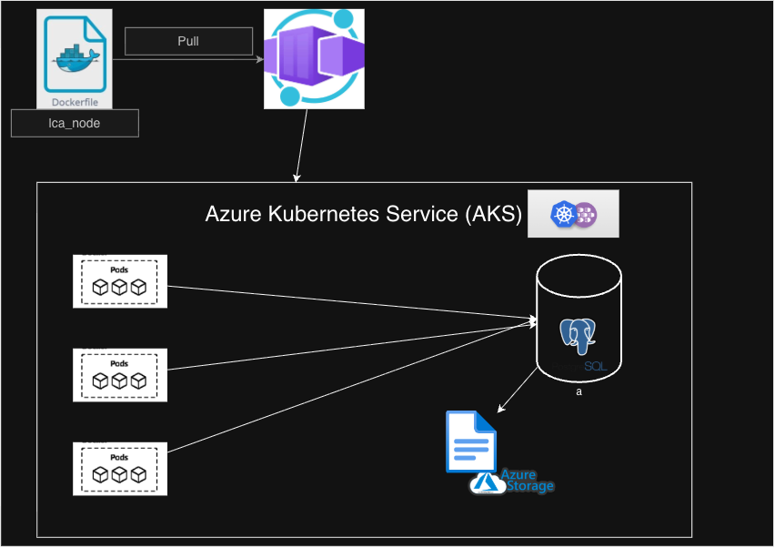

# Linux Cluster Monitoring Agent — Kubernetes CI/CD

## Introduction

The goal of this project is to provide centralized, automated monitoring of a
Linux server cluster. By continuously tracking the health and resource usage of
every machine, the team has a single, up-to-date view of the entire health of each node within the cluster.
The system collects metrics from every node automatically and stores them in one place 
that will be used for analysis, while the deployment itself is automated so new 
versions roll out with a single pipeline run.

## Application architecture:
The monitoring agent runs as a Kubernetes DaemonSet (one agent pod per node), each collecting metrics from the node it
runs on and writing to a centralized PostgreSQL database 
deployed as a StatefulSet with a persistent volume. 
A Kubernetes Service gives the database a stable
network address. This system allows for agents to 
collect on a timer and write out, so it does not use a load balancer
or request-based auto-scaling.

**Dev and prod environments:** Two separate AKS clusters (`lca-cluster-dev` and
`lca-cluster-prod`), each with its own PostgreSQL database, both pulling the
same container image from a shared Azure Container Registry (ACR). 

**Note:** Environments are isolated so development work cannot affect production.

## Jenkins CI/CD pipeline:

Jenkins runs a Declarative Pipeline that authenticates to Azure using a service principal and
deploys the application via Docker Image of our application then deploys. 

Dev deploys the `develop`
branch prod deploys `master`.

## Application Architecture

The agent is packaged as a container image (`lca_node`) and run as a DaemonSet,
placing one collector pod on every node. Each
