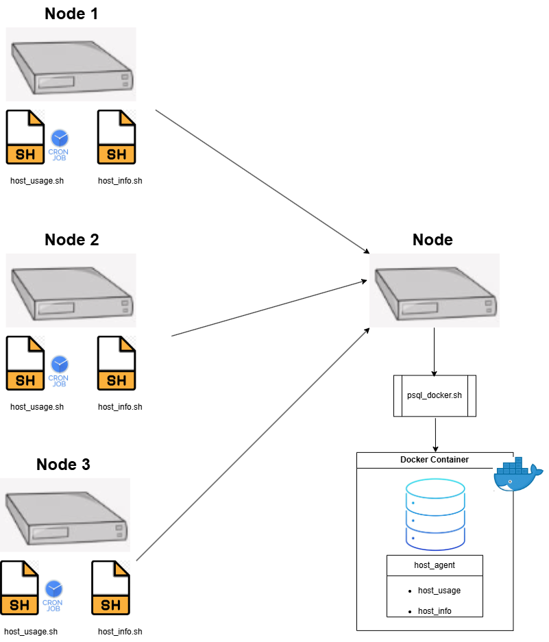

# Linux Cluster Monitoring Agent

# Introduction
The **Linux Cluster Monitoring Agent (LCA)** is a **cron-based service** built to monitor a networked Linux cluster's **hardware** and **performance**. Each **node** captures its **hardware specifications** upon setup and logs ongoing **resource usage** at scheduled intervals to a centralized **PostgreSQL** database (`host_agent`). Data is inserted into two tables: `host_info` and `host_usage`, which record the **hardware specifications** and **node usage** respectively. This architecture ensures efficient data storage, querying, and analysis by the **LCA team at Jarvis**, providing the team with a comprehensive log for the entire cluster. This project uses **PostgreSQL** for the database, **Bash** to run the shell scripts that retrieve usage and hardware data, **Docker** to manage the PostgreSQL server, and **Git/GitHub** to manage the project.

# Quick Start
These steps will help intializing the monitoring agent on a single host and connect it to the centralized host_agent database.

- Create and start a psql instance using psql_docker.sh
  ```
  bash scripts/psql_docker.sh create postgres password
  bash scripts/psql_docker.sh start`
  ```
- Create tables using ddl.sql
  ```
  # Connect to psql instance
  psql -h localhost -U postgres -W

  # Create a database
  postgres=# CREATE DATABASE host_agent;

  # Create table host_agent
  psql -h localhost -U <db_username> -d host_agent -f ./sql/ddl.sql
  ```
  
- Insert hardware specs data into the DB using host_info.sh
  ```
  ./scripts/host_info.sh localhost 5432 host_agent <db_username> <db_password>
  ```
- Insert hardware usage data into the DB using host_usage.sh
  ```
  ./scripts/host_usage.sh localhost 5432 host_agent <db_username> <db_password>
  ```
- Crontab setup to automate host_usage.sh and record **every minute**
  ```
  crontab -e
  * * * * * bash /<path_from_root>/linux_sql/scripts/host_usage.sh localhost 5432 host_agent <db_username> <db_password> > /tmp/host_usage.log
  ```
- Can check Crontab using:
  ```
  crontab -l
  ```

# Implemenation

## Architecture
This architecture shows a **host node** running a **Docker container** with a **PostgreSQL** image that stores the **hardware specifications** and **usage data** from three **client nodes**. Each client node runs `host_info.sh` and `host_usage.sh`, which are automated via **crontab** to record data every minute and send it over the network to the host. The host node acts as a centralized database (`host_agent`), ensuring all client data is collected and stored for efficient monitoring and analysis.



## Scripts

**psql_docker.sh:**
Used to create, start, and stop the Docker database instance.
```bash
# Create a new PostgreSQL container
./scripts/psql_docker.sh create db_username db_password

# Start an existing container
./scripts/psql_docker.sh start

# Stop a running container
./scripts/psql_docker.sh stop
```

**host_info.sh:**
Collects static hardware specifications from the host machine and inserts them into the 
`host_info` table. This script is intended to run once per host since hardware specs 
rarely change.
```bash
./scripts/host_info.sh <host> <port> host_agent db_username db_password
```

**host_usage.sh:**
Collects resource usage metrics including CPU usage, free memory, disk I/O, 
and available disk space. Inserts a new row into the `host_usage` table on every run.
```bash
./scripts/host_usage.sh <host> <port> host_agent db_username db_password
```

**crontab:**
Automates `host_usage.sh` to run every minute, continuously collecting resource metrics 
without manual intervention.
```bash
# Edit crontab
crontab -e

# Run host_usage.sh every minute
* * * * * bash /home/rocky/scripts/host_usage.sh localhost 5432 host_agent db_username db_password > /tmp/host_usage.log

# Verify crontab is set
crontab -l
```

## Database Modeling
**host_info**

| Column | Type | Description |
|--------|-----------|-------------|
| id | SERIAL | Auto-generated unique identifier for each host |
| hostname | VARCHAR | Domain name of the host |
| cpu_number | INT2 | # of CPU cores |
| cpu_architecture | VARCHAR | CPU architecture |
| cpu_model | VARCHAR | CPU model name |
| cpu_mhz | FLOAT8 | CPU clock speed in MHz |
| l2_cache | INT4 | Amount of L2 cache available |
| timestamp | TIMESTAMP | Timestamp of when extracted (UTC) |
| total_mem | INT4 | Total system memory in KB |

**host_usage**

| Column | Type | Description |
|--------|-----------|-------------|
| timestamp | TIMESTAMP | Time the record was inserted (UTC) |
| host_id | INT | Foreign key referencing host_info.id (Auto increments) |
| memory_free | INT4 | Available free memory in KB |
| cpu_idle | INT2 | Percentage of CPU time spent idle |
| cpu_kernel | INT2 | Percentage of CPU time spent in kernel mode |
| disk_io | INT4 | Number of disk I/O operations per second |
| disk_available | INT4 | Total MB of data available on the entire disk |

# Test
To test whether the DDL has been created, I used the following line:
``bash -x /path/to/linux_sql/scripts/ddl.sh [arguments]``
Executing this code, allows me to view the script step by step as well as see the output of the file. 


Another way I can log into my PSQL server and then connect the `host_agent` to check manually if the tables were created correctly
Here are the steps to check using this method: 
```
# Connect to psql instance
psql -h localhost -U postgres -W

# Connect to host_agent database
\c host_agent

# List tables to verify 
\dt
```

# Deployment

**Docker & PostgreSQL**: The storage backend is deployed using Docker to host a PostgreSQL instance. By pulling the official image, we ensure a standardized, containerized database environment that is isolated from the host system and easily portable.


**Crontab:** Automation on the host machine is managed via crontab. This ensures that the ``host_usage.sh`` script executes consistently every minute.


**GitHub:** Code itself is managed through GitHub. This serves as the central repository for the monitoring scripts and database schemas, facilitating version control and easy distribution to client and host nodes.


# Improvements

**Hardware Lifecycle:** By adding a crontab to the ``host_info.sh`` as well every month to ensure that the database maintains an accurate, up-to-date record of the cluster's physical specifications over time.

Going this route, I would build upon the current database schema, where I would keep the host info as is but then create a second table ``host_hardware_changes``. A monthly cron job would compare current specs against the database; any discrepancies (ex. RAM upgrades or CPU swaps) would be logged as a versioned entry. This creates a searchable audit trail of the cluster’s hardware spec over time.

**Automated Configuration Management:** Replace manual node-by-node initialization with a centralized configuration management tool (ex. **Ansible**). This allows for concurrent deployment and management of the monitoring agent across hundreds of nodes via SSH instead of manual overhead.


  

  

