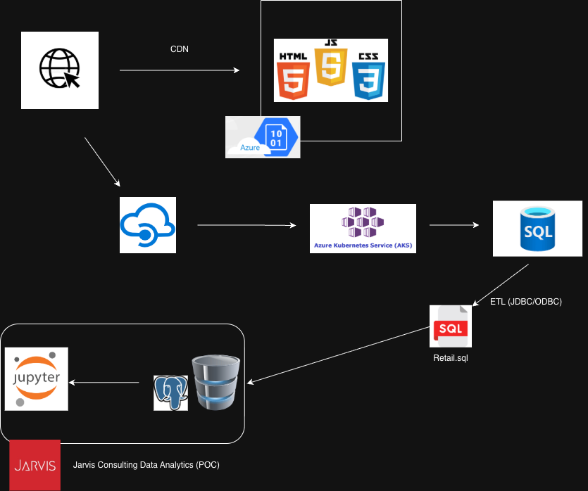

# Introduction
London Gift Shop (LGS) is a UK-based online store that sells giftware. Many customers of the company are wholesalers. 
The company has been running online shops for more than 10 years to customers across the UK and internationally. 
This project analyzes two years of transactional data (2009–2011) to find actionable insights that LGS can use to protect and increase revenue. 
The analytics results will allow LGS to:

- Identify and retain their highest-value customers through targeted loyalty programs
- Design win-back campaigns for at-risk customers before revenue is permanently lost
- Optimize inventory planning and marketing spend around predictable seasonal peaks
- Monitor customer health over time to detect early signs of churn

**Technologies used:**

**Data Analysis & Visualization**
- **Python** — core programming language
- **pandas** — data wrangling, transformation, and aggregation
- **numpy** — numerical computations
- **matplotlib / seaborn** — data visualization and charting

**Database & Connectivity**
- **PostgreSQL** — data warehouse storing raw retail transaction data
- **sqlalchemy** — ORM layer for connecting Python to PostgreSQL
- **psycopg2** — PostgreSQL database driver

**Development Environment**
- **Jupyter Notebook** — interactive data wrangling and visualization
- **Docker** — containerized Jupyter and PostgreSQL environments

**Analytics Methodology**
- **RFM Analysis** — industry-standard customer segmentation framework (Recency, Frequency, Monetary)

# Implementation
## Project Architecture
**LGS Web Application**

**Frontend** - a browser-facing application served via Content Delivery Network (CDN), in an azure storage that stores HTML/CSS/JavaScript and images.

**Backend** — browser requests hit Azure API Management, which routes to an AKS Kubernetes cluster running microservices, which persist transactional data to an Azure SQL Server (OLTP) database

**Jarvis Consulting PoC Environment**
Jarvis team does not have access to the LGS environment, the LGS IT team extracted transactional data from Azure SQL Server via ETL (JDBC/ODBC) in a `retail.sql` file.
The Jarvis PoC environment consists of:

**PostgreSQL Data Warehouse** — stores the raw retail transaction data containing 1,067,371 rows ranging December 2009 to December 2011. Data was loaded from the provided `retail.sql` file.

**Jupyter Notebook Analytics** — connects to PostgreSQL via SQLAlchemy, performs data wrangling, cleaning, transformation, and produces visual analytics insights.

Both PostgreSQL and Jupyter run in Docker containers connected through a shared **Docker bridge network**.

The dataset contains the following attributes:

| Column | Type | Description |
|---|---|---|
| `invoice_no` | Nominal | 6-digit invoice number. Starts with 'C' if canceled |
| `stock_code` | Nominal | 5-digit product code uniquely assigned to each product |
| `description` | Nominal | Product name |
| `quantity` | Numeric | Quantity of each product per transaction |
| `invoice_date` | Numeric | Date and time the transaction was generated |
| `unit_price` | Numeric | Product price per unit in sterling (£) |
| `customer_id` | Nominal | 5-digit number uniquely assigned to each customer |
| `country` | Nominal | Country where the customer resides |

## Data Analytics and Wrangling

[retail_data_analytics_wrangling.ipynb](./retail_data_analytics_wrangling.ipynb)

The following analytics were performed to help LGS increase revenue:

**Monthly Sales & Growth**
Monthly sales data reveals a clear Q4 holiday peak in 2010, with November and December generating significantly higher revenue.
Note that December 2009 and December 2011 appear lower due to potentially an incomplete data at the start and end of the dataset.
The consistent Q4 seasonal pattern gives LGS a window to proactively plan strategies such as inventory restocking or targeted promotions to
maximize revenue during these peaks.

**New vs Existing User Revenue Split**
Existing customers consistently contribute the most up to ~80% of monthly revenue. This tells LGS could potentially invest into customer 
retention rather than on new customers as this yields a higher ROI.

**RFM Customer Segmentation**
Customers were scored and segmented into 11 groups using Recency, Frequency, and Monetary analysis.
LGS can use this to:
- Reward Champions with loyalty programs and early access or any promotions to focus on retaining.
- Target At Risk customers with personalized win-back campaigns
- Avoid wasting marketing budget on Lost customers

**At Risk Revenue Alert**
Using RFM health status groupings, customers classified as "At Risk" were identified and quantified by revenue.
This gives LGS a clear picture of how much revenue is at risk and which customer segments require immediate retention outreach.

**Customer Health Status Over Time**
Customers were grouped into three health categories — Healthy, At Risk, and Churned and tracked monthly. Healthy customers grew nearly 
double from 2009 to 2011 while At Risk and Churned customers declined, indicating improving retention. LGS can use this as an early warning 
dashboard to detect churn before revenue is lost.

# Improvements

**Predictive Churn Model**
Could build a machine learning model (e.g. logistic regression or random forest) to predict which customers are likely to churn 
before they appear in the At Risk segment to allow for early detection.

**Customer Retention Tracking**
Group customers by when they first purchased and track how many keep coming back over time follow each group of new customers 
over time and see how many keep coming back month after month.

**Real-time Churn Detection**
Instead of identifying at-risk customers after the fact, build an automated alert system that flags customers the moment their RFM score changes.
