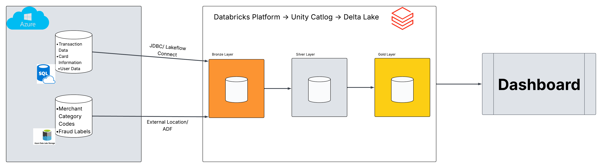
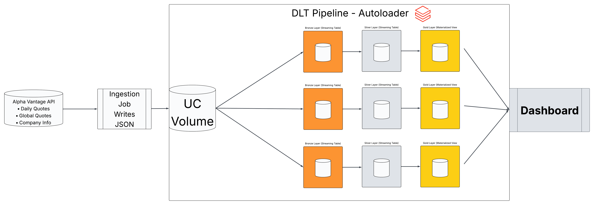

## Introduction

This project was built on **Databricks**, applying the **medallion architecture** (**bronze** → **silver** → **gold**) to turn raw source data into transformed tables that will be displayed via dashboards. The project will be ingesting data from external systems, transforming it through layered pipelines, as well as orchestrating the workflow through Databricks.

Two pipelines will be developed for different ingestion and pipeline styles. One is a batch ETL over financial fraud data sourced from Azure. The other is a declarative streaming pipeline over market data pulled from an API.

**Technologies used:** Databricks, PySpark, Databricks Declarative Pipelines (DLT), Auto Loader, Unity Catalog, Delta Lake, Azure (SQL Database, Data Lake Storage, Data Factory), JDBC, Lakeflow Connect, the Alpha Vantage REST API, and Databricks Jobs for orchestration.

## Databricks Implementation

Both projects run on Databricks and share the same medallion backbone: raw data lands untouched in **bronze**, gets typed and cleaned in **silver**, and is aggregated into query-ready **gold** tables that feed a dashboard. 

### Financial Fraud ETL

**Dataset.** A synthetic banking dataset covering the 2010s, combining detailed card transactions with customer and card context: `transactions_data.csv` (amounts, timestamps, merchant details), `cards_data.csv` (card metadata), `users_data.csv` (customer demographics), `mcc_codes.json` (merchant-category classification codes), and `train_fraud_labels.json` (binary fraud/legitimate labels). It supports fraud detection, customer-behavior analysis, and spend forecasting.

**Analytics work.** The silver transaction table is enriched by joining in the MCC codes and fraud labels, so downstream analysis has both a human-readable merchant category and a fraud flag on every transaction. The gold layer then answers targeted fraud questions, including: which days of the week see the most fraud, how the fraud rate trends month over month, which users and merchants carry the highest fraud volume, which merchant categories have the highest fraud rate and total fraud loss, how fraud is distributed by time of day, average transaction amount for fraud vs. non-fraud, daily monetary losses to fraud, and whether fraud skews toward high-value purchases. These tables are the direct source for the dashboard.

> Notebooks: [`ETL_databricks_bronze.ipynb`](./ETL_pipeline/ETL_databricks_bronze.ipynb) · [`ETL_databricks_silver.ipynb`](./ETL_pipeline/ETL_databricks_silver.ipynb)) · [`ETL_databricks_gold.ipynb`](./ETL_pipeline/ETL_databricks_gold.ipynb))

**Architecture & data flow.** Ingestion is multi-source into Databricks: `transactions_data.csv` and `cards_data.csv` are loaded into an **Azure SQL Database** and pulled into Databricks over **JDBC** and **Lakeflow Connect**; `users_data.csv` and the JSON files land in **Azure Data Lake Storage** and are pulled through a Unity Catalog **external location**, with **Azure Data Factory** used to copy the `mcc_codes` and `fraud_labels` JSON into Delta. From there the medallion layers run as **separate notebooks per stage** — running the bronze notebook refreshes every bronze table, and likewise for silver and gold — and a Databricks **Job** chains Bronze → Silver → Gold → Dashboard refresh.

### Stock Market DLT

**Dataset.** Daily stock data for **AAPL, MSFT, GOOGL, NVDA**, pulled from three Alpha Vantage endpoints: `TIME_SERIES_DAILY` (open/high/low/close/volume history), `GLOBAL_QUOTE` (latest snapshot per ticker), and `OVERVIEW` (company name, sector, industry, exchange, market cap).

**Analytics work.** The gold layer computes **price change, price percentage change, and volume change over 7, 30, 90 trading-day windows** per symbol with a batch read. Quote and company data feed the dashboard's current-price header and human-readable company labels rather than the trend math.

**Architecture & data flow.** Python **ingestion job** calls the API and lands raw JSON into a Unity Catalog **Volume** (`/Volumes/.../raw/{daily,quote,company}`) — ingestion is kept out of the pipeline because DLT table functions can't perform network calls or side effects. The **DLT pipeline** then reads those folders with **Auto Loader** (`cloudFiles`) into streaming bronze tables, cleans and de-duplicates them in silver, and materializes the windowed gold table. A Databricks **Job** orchestrates ingestion → pipeline update → dashboard refresh on a daily schedule.

**Design decisions** Bronze and silver are **streaming tables**. Gold is a **materialized view** because its window functions recompute over full history. Company and latest quote only pull the latest row per symbol. The pipeline runs in **Triggered** mode (process available data, then stop) rather than Continuous, which suits a once-daily batch and is cheaper. **Failure handling** relies on DLT retries, silver **expectations** to drop bad rows, and an rate-limit guard in ingestion that raises on the API's response instead of writing null files.

---

## Future Improvements

1. **Full history and proper change tracking.** Switch the stock ingestion to `outputsize=full` so the 90-day windows populate meaningfully, and model the company/quote dimensions as **SCD Type 2** to retain history of changes over time, with incremental gold recomputation instead of full rebuilds as data grows.

2. **Performance and cost tuning.** Apply partitioning / liquid clustering on the large gold tables, and add a monitoring dashboard for pipeline run times, row counts per layer, and job cost, making the pipelines cheaper and easier to reason about as volume grows.
